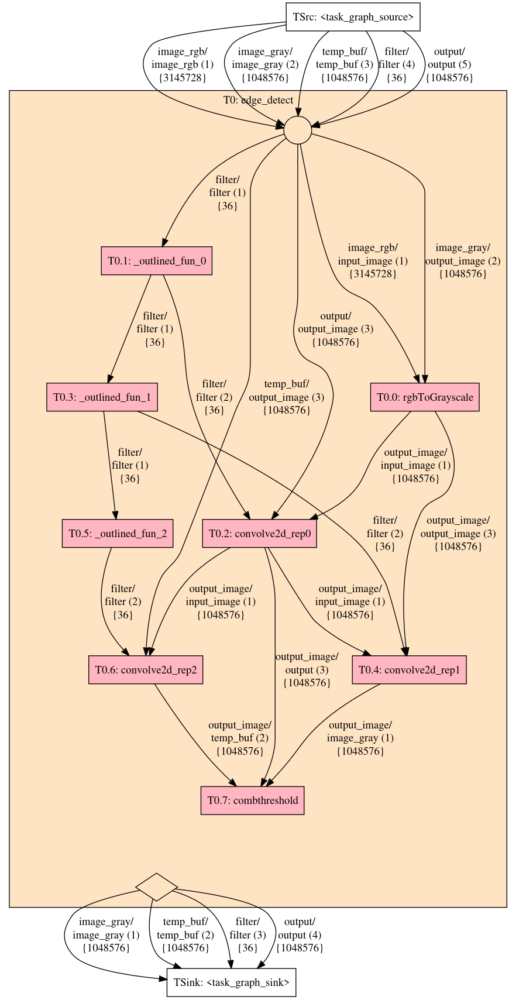

# Extended Task Graph

This is an implementation of the [Extended Task Graph (ETG)](https://dl.acm.org/doi/abs/10.1145/3652032.3657580) intermediate representation for C/C++, built as an extension for the [Clava](https://github.com/specs-feup/clava) C/C++ to C/C++ Source-to-source compiler. Just like the compiler itself, it is packaged and distributed as an NPM package, which can be either used as a standalone app or as a library for other Clava-based NPM projects.

 These task graphs are automatically analyzed and characterized by several metrics, and through a highly flexible granularity mechanism we can perform extensive graph operations, such as task merging, splitting and clustering, while always outputting valid and readable C/C++ source code.

 

## How to Use

The ETG is an NPM package, and it can be used both as a standalone, and as a library/extension to your own Clava-based scripts and projects

### Prerequisites

The ETG is developed and validated on Ubuntu 24.x. However, it should work on all other OS supported by Clava and node.js. Make sure you have node.js 18 or higher installed, and optionally Graphviz to render/visualize the task graphs. For Ubuntu:

```bash
apt update && apt upgrade -y
sudo apt install graphviz curl -y
curl -fsSL https://deb.nodesource.com/setup_current.x | bash -
apt install -y nodejs
node -v && npm -v
```

### As a standalone app

TBD

### As a library/extension

Here is an example of how to integrate this into your own Clava-based NPM project:

1. Create a workspace directory, clone a required repository, and create your new project (replace `my-proj` by your project's name):

```bash
PROJ_NAME=my_proj  # change this
mkdir clava-workspace
cd workspace
mkdir $PROJ_NAME
git clone https://github.com/tiagolascasas/clava-js-code-transforms
cat <<EOF > package.json
{
  "name": "clava-workspace",
  "version": "1.0.0",
  "private": true,
  "workspaces": [
    "clava-js-code-transformations",
    "$PROJ_NAME"
}
EOF

cd clava-js-code-transforms
npm install
cd ../$PROJ_NAME
```

2. In your project folder, make sure you are including both the Clava package, as well as the ETG package. An easy way to bootstrap your Clava-based project is to use [this template](https://github.com/specs-feup/clava-project-template). Regardless, make sure you end up with a `package.json` whose `name` field matches the name of the folder and with these two dependencies:

```json
{
    "name": "my_proj",
    //...
    "dependencies": {
        "@specs-feup/clava": "3.0.1",
        "clava-code-transformations": "^1.0.0",
        //...
  },
  //...
}
```

Then, make sure you run `npm install` on both your project and on the parent `clava-workspace` folder. You can check the examples in [this folder](https://github.com/specs-feup/extended-task-graph/tree/main/test/simple-use-cases) to see how to use the ETG API in your own scripts.

### Outputs

Under normal usage (i.e., running the entire flow from code preprocessing, task graph generation and subsequent extraction of metrics) the extension outputs the following folders:

```
<app name>
├-── ast
│   ├── original - some metrics about the original application's source code, as well as its call graph and AST
│   └── trans - same as the above, but after applying all code preprocessing transformations
├── etg - all the information about the task graph, including two dotfiles of the graph (one complete, the other simplified) and a JSON filled with statistical information about the graph
└── src
    ├── original - the source code of the original program. It differs from the input only in that all macros have been resolved
    ├── subset - the source code after the preprocessing transformations are applied, except for function outlining
    ├── trans - the source code after applying function outlining, i.e., a valid representation for generating task graphs
    └── trans_instr - the same as the above, but with time measuring instrumentation for each function. Useful for profiling
```
